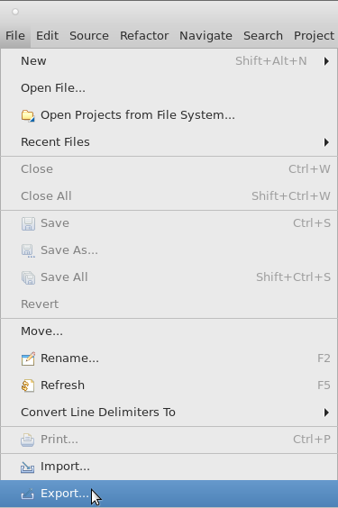
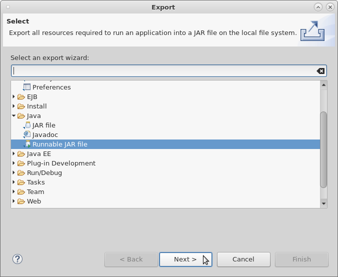
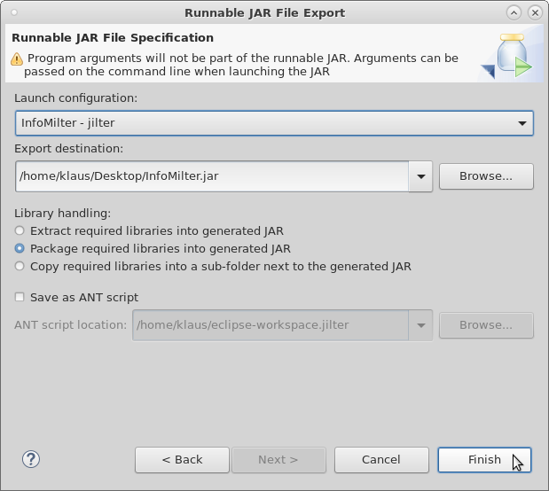

# jilter-InfoMilter
Milter for Sendmail or Postfix to log all possible parts of the e-Mail communication, written in Java.

The project was based on the great work of Sendmail-Jilter which is an Open Source implementation of the Sendmail milter protocol, for implementing milters in Java that can interface with the Sendmail MTA based on a project of sendmail-jilter http://sendmail-jilter.sourceforge.net/

## Changelog
The following changes were made in comparison to the original JAR file.

- Simplify the class structure.
- Correct 7 Warnings with Java 1.8.
- Change from log4j-1.2.8.jar to log4j2.
- Add log4j2.xml
- Do NOT use SimpleJilterServer.java, use instead only InfoMilter.java.
- Add capability to use the args from main class with Apache CLI Parser.
- Add complete list of possible MILTER features (but NOT implemented).
- Add original LICENSE.txt to the project.

## JAR-File description
The **exection of the JAR file with the option ```-h``` or ```--help```** with following command, will show you all **options** you can set, to start the **InfoMilter.jar**:
```bash
# java -jar InfoMilter.jar -h
usage: [-i <IPv4-Address to listen>] [-p <Port to listen>] [-l <Log-Level>] [-h]
           [-v] [-d]

InfoMilter for Sendmail or Postfix to log all possible parts of the e-Mail
communication.

 -d,--debug            DEBUG mode with runtime output
 -h,--help             Print this usage information
 -i,--listener <arg>   [REQUIRED] IPv4-Address where the milter is listening on
 -l,--logging <arg>    Enables the Logging for Jilter with the specified log
                       level (ALL, INFO, WARN, ERROR, TRACE, DEBUG or OFF)
 -p,--port <arg>       [REQUIRED] Port where the milter is listening on
 -v,--version          Version of the program

Copyright (c) 2018 Klaus Tachtler, <klaus@tachtler.net>. All Rights Reserved.
Version 1.0.

```

## JAR-File execution
The **execution of the JAR file** could be done, for example on a Linux ```shell``` with following command:
```bash
# java -jar InfoMilter.jar -i 127.0.0.1 -p 10099
2018-11-08 05:38:06,513 [INFO ] [InfoMilterHandler                       ] [close                                   ] ----------------------------------------: 
2018-11-08 05:38:06,517 [INFO ] [InfoMilterHandler                       ] [close                                   ] sendmail-jilter - ENTRY: close          : 
2018-11-08 05:38:06,517 [INFO ] [InfoMilterHandler                       ] [close                                   ] ----------------------------------------: 
2018-11-08 05:38:06,517 [INFO ] [InfoMilterHandler                       ] [close                                   ] ----------------------------------------: 
2018-11-08 05:38:06,517 [INFO ] [InfoMilterHandler                       ] [close                                   ] sendmail-jilter - LEAVE: close          : 
2018-11-08 05:38:06,517 [INFO ] [InfoMilterHandler                       ] [close                                   ] ----------------------------------------
^C
```
and could be **stopped** with **[CTRL-c]** key combination.

Under **Linux**, you can see with following command, on which **ipv4-address and port** the **InfoMilter.jar** was bind to:
```bash
# netstat -tulpen | grep java
tcp       0      0 127.0.0.1:10099        0.0.0.0:*            LISTEN      1000       29631      4643/java
```

## Postfix Milter integration
In order to include InforMilter.jar with , minimal adjustments are required in the two following configuration files of Postfix.
  - ```/etc/postfix/main.cf```
  - ```/etc/postfix/master.cf```

#### ```/etc/postfix/main.cf``` 
(Only relevant part of the configuration file!)
```
# --------------------------------------------------------------------------------
# New - http://www.postfix.org/MILTER_README.html
# MILTER CONFIGURATIONS
# --------------------------------------------------------------------------------

# JMilter (info_milter)
info_milter = inet:127.0.0.1:10099
```

#### ```/etc/postfix/master.cf```

(Only relevant part of the configuration file!)
```
#
# Postfix master process configuration file.  For details on the format
# of the file, see the master(5) manual page (command: "man 5 master").
#
# Do not forget to execute "postfix reload" after editing this file.
#
# ==========================================================================
# service type  private unpriv  chroot  wakeup  maxproc command + args
#               (yes)   (yes)   (yes)   (never) (100)
# ==========================================================================
smtp      inet  n       -       n       -       -       smtpd
# InfoMilter
   -o smtpd_milters=${info_milter}
```

:exclamation: **After the changes in the configuration files, you have to restart the Postfix Daemon!**

## Telnet e-Mail-Test
The following **telnet session** will show you the usage of the InfoMilter.jar in combination with ```telnet```.
```bash
# telnet 127.0.0.1 25
Trying 127.0.0.1...
Connected to 127.0.0.1.
Escape character is '^]'.
220 test.example.com ESMTP Postfix
ehlo test.example.com
250-test.example.com
250-PIPELINING
250-SIZE 10240000
250-VRFY
250-ETRN
250-ENHANCEDSTATUSCODES
250-8BITMIME
250 DSN
mail from: <root@example.com>
250 2.1.0 Ok
rcpt to: <klaus@example.com>
250 2.1.5 Ok
data
354 End data with <CR><LF>.<CR><LF>
Subject: Test e-Mail.
From: sender@example.com
To: receiver@example.com

Hello,

test e-Mail.

Greetings
.
250 2.0.0 Ok: queued as E45CF6E858
quit
221 2.0.0 Bye
Connection closed by foreign host.
```

## LOG-File output
While using the InfoMilter.jar the following output will be written to the **standard command output (```screen / shell```) and a folder named logs will be created, which includes the ```jilter.log``` file and \*.tar.gz files with older logs.**

An **example output file** could be look like this. (It's based on the **Telnet e-Mail-Test** - **telnet-session** shown above):
```
----------------------------------------: 
sendmail-jilter - ENTRY: close          : 
----------------------------------------: 
----------------------------------------: 
sendmail-jilter - LEAVE: close          : 
----------------------------------------: 
----------------------------------------: 
sendmail-jilter - ENTRY: connect        : String hostname, InetAddress hostaddr, Properties properties
----------------------------------------: 
*hostname                               : localhost
*hostaddr.getCanonicalHostName()        : localhost
*hostaddr.getHostAddress()              : 127.0.0.1
*hostaddr.getHostName()                 : localhost
*hostaddr.getAddress()                  : Octet: [127, 0, 0, 1] / Byte: [127, 0, 0, 1]
*hostaddr.isAnyLocalAddress()           : false
*hostaddr.isLinkLocalAddress()          : false
*hostaddr.isLoopbackAddress()           : true
*hostaddr.isMCGlobal()                  : false
*hostaddr.isMCLinkLocal()               : false
*hostaddr.isMCNodeLocal()               : false
*hostaddr.isMCOrgLocal()                : false
*hostaddr.isMCSiteLocal()               : false
*hostaddr.isMulticastAddress()          : false
*hostaddr.isReachable(timeout)          : true
*hostaddr.isReachable(netif, ttl, tim...: true
*hostaddr.isSiteLocalAddress()          : false
*poperties.toString()                   : {v=Postfix 2.10.1, j=test.example.com, {daemon_name}=test.example.com}
*properties.getProperty("v")            : Postfix 2.10.1
*properties.getProperty("j")            : test.example.com
*properties.getProperty("{daemon_name}"): test.example.com
----------------------------------------: 
sendmail-jilter - LEAVE: connect        : String hostname, InetAddress hostaddr, Properties properties
----------------------------------------: 
----------------------------------------: 
sendmail-jilter - ENTRY: helo           : String helohost, Properties properties
----------------------------------------: 
*helohost                               : test.example.com
*poperties.toString()                   : {}
----------------------------------------: 
sendmail-jilter - LEAVE: helo           : String helohost, Properties properties
----------------------------------------: 
----------------------------------------: 
sendmail-jilter - ENTRY: envfrom        : String[] argv, Properties properties
----------------------------------------: 
*argv[i]                                : [0] <root@example.com>
*poperties.toString()                   : {{mail_host}=mx1.example.com, {mail_addr}=root@example.com, {mail_mailer}=smtp}
*poperties.getProperty("{mail_host}")   : mx1.example.com
*poperties.getProperty("{mail_addr}")   : root@example.com
*poperties.getProperty("{mail_mailer}...: smtp
----------------------------------------: 
sendmail-jilter - LEAVE: envfrom        : String[] argv, Properties properties
----------------------------------------: 
----------------------------------------: 
sendmail-jilter - ENTRY: envrcpt        : String[] argv, Properties properties
----------------------------------------: 
*argv[i]                                : [0] <klaus@example.com>
*poperties.toString()                   : {{rcpt_host}=mx1.example.com, {rcpt_mailer}=smtp, {rcpt_addr}=klaus@example.com}
*poperties.getProperty("{rcpt_host}")   : mx1.example.com
*poperties.getProperty("{rcpt_mailer}...: smtp
*poperties.getProperty("{rcpt_addr}")   : klaus@example.com
*poperties.getProperty("i")             : null
----------------------------------------: 
sendmail-jilter - LEAVE: envrcpt        : String[] argv, Properties properties
----------------------------------------: 
----------------------------------------: 
sendmail-jilter - ENTRY: header         : String headerf, String headerv
----------------------------------------: 
*headerf: headerv                       : Subject: Test e-Mail
----------------------------------------: 
sendmail-jilter - LEAVE: header         : String headerf, String headerv
----------------------------------------: 
----------------------------------------: 
sendmail-jilter - ENTRY: header         : String headerf, String headerv
----------------------------------------: 
*headerf: headerv                       : From: sender@example.com
----------------------------------------: 
sendmail-jilter - LEAVE: header         : String headerf, String headerv
----------------------------------------: 
----------------------------------------: 
sendmail-jilter - ENTRY: header         : String headerf, String headerv
----------------------------------------: 
*headerf: headerv                       : To: receiver@example.com
----------------------------------------: 
sendmail-jilter - LEAVE: header         : String headerf, String headerv
----------------------------------------: 
----------------------------------------: 
sendmail-jilter - ENTRY: header         : String headerf, String headerv
----------------------------------------: 
*headerf: headerv                       : Message-Id: <20181108042333.E45CF6E858@test.example.com>
----------------------------------------: 
sendmail-jilter - LEAVE: header         : String headerf, String headerv
----------------------------------------: 
----------------------------------------: 
sendmail-jilter - ENTRY: header         : String headerf, String headerv
----------------------------------------: 
*headerf: headerv                       : Date: Thu,  8 Nov 2018 05:23:24 +0100 (CET)
----------------------------------------: 
sendmail-jilter - LEAVE: header         : String headerf, String headerv
----------------------------------------: 
----------------------------------------: 
sendmail-jilter - ENTRY: eoh            : 
----------------------------------------: 
----------------------------------------: 
sendmail-jilter - LEAVE: eoh            : 
----------------------------------------: 
----------------------------------------: 
sendmail-jilter - ENTRY: body           : ByteBuffer bodyp
----------------------------------------: 
bodyp                                   : java.nio.HeapByteBuffer[pos=0 lim=37 cap=37]
bodyp      <-- (Start at next line) --> : 
Hello,

test e-Mail.

Greetings

----------------------------------------: 
sendmail-jilter - LEAVE: body           : ByteBuffer bodyp
----------------------------------------: 
----------------------------------------: 
sendmail-jilter - ENTRY: eom            : JilterEOMActions eomActions, Properties properties
----------------------------------------: 
*poperties.toString()                   : {i=E45CF6E858}
*poperties.getProperty("i")             : E45CF6E858
----------------------------------------: 
sendmail-jilter - LEAVE: eom            : JilterEOMActions eomActions, Properties properties
----------------------------------------: 
----------------------------------------: 
sendmail-jilter - ENTRY: abort          : 
----------------------------------------: 
----------------------------------------: 
sendmail-jilter - LEAVE: abort          : 
----------------------------------------: 
----------------------------------------: 
sendmail-jilter - ENTRY: abort          : 
----------------------------------------: 
----------------------------------------: 
sendmail-jilter - LEAVE: abort          : 
----------------------------------------: 
----------------------------------------: 
sendmail-jilter - ENTRY: close          : 
----------------------------------------: 
----------------------------------------: 
sendmail-jilter - LEAVE: close          : 
----------------------------------------:

```

## E-Mail source code
After successfully submitting the e-Mail previously generated with the **Telnet e-Mail-Test** - **telnet-session**, it would look like this in the source code: (**Please also note the additional header entry: ```X-Logged: Jilter``` !**)
```
Return-Path: <root@example.com>
Delivered-To: klaus@example.com
Received: from mx1.example.com ([192.168.0.60])
	(using TLSv1.2 with cipher ECDHE-RSA-AES256-GCM-SHA384 (256/256 bits))
	by imap.example.com with LMTP id ADqXAXG641t1SAAAhm5hYQ
	for <klaus@example.com>; Thu, 08 Nov 2018 05:24:17 +0100
Received: from viruswall.example.com (server70.example.com [192.168.0.70])
	(using TLSv1.2 with cipher ECDHE-RSA-AES256-GCM-SHA384 (256/256 bits))
	(Client did not present a certificate)
	by mx1.example.com (Postfix) with ESMTPS id C22771800091
	for <klaus@example.com>; Thu,  8 Nov 2018 05:24:16 +0100 (CET)
DKIM-Filter: OpenDKIM Filter v2.11.0 mx1.example.com C22771800091
DKIM-Signature: v=1; a=rsa-sha256; c=relaxed/simple; d=example.com; s=main;
	t=1541651056; bh=nanuAANV0Fc5yhcyI4rRzJpYcbVJ94I51e5pJzCUlf8=;
	h=Subject:From:To:Date:From;
	b=UtC4l6LPoDiB7vpMo/ID5NN0Ny4mxnaWuqsjvLnFDh+OwBaEnylgz42nnSDluc1Yd
	 qACiVmNF3463Z4ijlYEN4dwEej+D5IoChqRGWi8GqFmdUjEiO/LaX3iatw2nYG5Ag2
	 OtZwzt3+qwT0E5H7ZkJrYd+9V3fI7S91sTNC/8hw=
X-Amavis-Modified: Mail body modified (using disclaimer) -
	server70.example.com
X-Virus-Scanned: amavisd-new at example.com
X-Spam-Flag: NO
X-Spam-Score: -1
X-Spam-Level:
X-Spam-Status: No, score=-1 tagged_above=-1000.0 required=6.31
	tests=[ALL_TRUSTED=-1] autolearn=ham autolearn_force=no
Received: from mx1.example.com ([192.168.0.60])
	by viruswall.example.com (server70.example.com [192.168.0.70]) (amavisd-new, port 10024)
	with ESMTP id wu69HQM2ShqH for <klaus@example.com>;
	Thu,  8 Nov 2018 05:24:15 +0100 (CET)
Received: from test.example.com (pmd020.home.example.com [192.168.0.20])
	(using TLSv1.2 with cipher ECDHE-RSA-AES256-GCM-SHA384 (256/256 bits))
	(Client CN "*.example.com", Issuer "CAcert Class 3 Root" (verified OK))
	by mx1.example.com (Postfix) with ESMTPS
	for <klaus@example.com>; Thu,  8 Nov 2018 05:24:14 +0100 (CET)
Received: from test.example.com (localhost [127.0.0.1])
	by test.example.com (Postfix) with ESMTP id E45CF6E858
	for <klaus@example.com>; Thu,  8 Nov 2018 05:23:24 +0100 (CET)
Subject: Test e-Mail
From: sender@example.com
To: receiver@example.com
Message-Id: <20181108042333.E45CF6E858@test.example.com>
Date: Thu,  8 Nov 2018 05:23:24 +0100 (CET)
X-Logged: Jilter

Hello,

test e-Mail.

Greetings

```

## JAR-File ([Eclipse from ECLIPSE Foundation](http://www.eclipse.org/))
The creation of the **InfoMilter.jar** could be done using [Eclipse from ECLIPSE Foundation](http://www.eclipse.org/) in only three steps:

**Step 1:**
Choose from [Eclipse from ECLIPSE Foundation](http://www.eclipse.org/) menu: File | Export...



**Step 2:**
On the upcomming dialog, search and choose **Runnable JAR file** and click **Next >**:



**Step 3:**
In the upcomming dialog, choose a **Launch configuration:** (if you have one), and the **Export destination:** and **IMPORTANT**, choose **Package required libraries into generated JAR** before you click **Finish**:



**You're done!**

## JAR-File (```shell``` or ```console```)
The creation of the **InfoMilter.jar** was done with following directory structure:
```
commons-cli-1.4.jar
log4j-api-2.11.1.jar
log4j-core-2.11.1.jar
log4j2.xml
com/sendmail/jilter/CustomJilterStatus.java
com/sendmail/jilter/JilterConstants.java
com/sendmail/jilter/JilterEOMActions.java
com/sendmail/jilter/JilterEOMActionsImpl.java
com/sendmail/jilter/JilterHandler.java
com/sendmail/jilter/JilterHandlerAdapter.java
com/sendmail/jilter/JilterPacket.java
com/sendmail/jilter/JilterProcessor.java
com/sendmail/jilter/JilterServerPacketUtil.java
com/sendmail/jilter/JilterStatus.java
com/sendmail/jilter/LICENSE.txt
com/sendmail/jilter/ServerRunnable.java
com/sendmail/jilter/SimpleJilterServer.java
com/sendmail/jilter/SimpleJilterStatus.java
com/sendmail/jilter/package.html
net/tachtler/jilter/InfoMilter.java
net/tachtler/jilter/InfoMilterCLIArgParserException.java
net/tachtler/jilter/InfoMilterCLIArgsParser.java
net/tachtler/jilter/InfoMilterCLIArgsParserBean.java
net/tachtler/jilter/InfoMilterHandler.java
net/tachtler/jilter/package-info.java
```

First create a **META-INF/MANIFEST.MF** file, with following commands:
```
# mkdir META-INF
# vi META-INF/MANIFEST.MF
```
with following content:
```
Manifest-Version: 1.0
Class-Path: . commons-cli-1.4.jar log4j-api-2.11.1.jar log4j-core-2.11.1.jar
Main-Class: net.tachtler.jilter.InfoMilter

```

The uploaded **InfoMilter.jar** was created with follwing commands:

Command for the \*.class compilation:)

(**Linux**):
```
javac -g:none -target 1.8 -cp .:*  com/sendmail/jilter/*.java net/tachtler/jilter/*.java
```
(**Windows**):
```
"<PATH-TO-JDK>\bin\javac.exe" -g:none -target 1.8 -cp * com/sendmail/jilter/*.java net\tachtler\jilter\*.java
```

Command for the JAR file creation:

(**Linux**):
```
jar cvfm InfoMilter.jar META-INF/MANIFEST.MF log4j2.xml *.jar com/sendmail/jilter/*.class net/tachtler/jilter/*.class
```
(**Windows**):
```
<PATH-TO-JDK>\bin\jar.exe" cvfe InfoMilter.jar META-INF/MANIFEST.MF log4j2.xml *.jar com/sendmail/jilter/*.class net/tachtler/jilter/*.class
```

(**Example: Linux**):
```
$ jar cvfm InfoMilter.jar META-INF/MANIFEST.MF log4j2.xml *.jar com/sendmail/jilter/*.class net/tachtler/jilter/*.class
added manifest
adding: log4j2.xml(in = 1027) (out= 484)(deflated 52%)
adding: commons-cli-1.4.jar(in = 53820) (out= 49458)(deflated 8%)
adding: log4j-api-2.11.1.jar(in = 264058) (out= 236389)(deflated 10%)
adding: log4j-core-2.11.1.jar(in = 1607936) (out= 1426304)(deflated 11%)
adding: com/sendmail/jilter/CustomJilterStatus.class(in = 2270) (out= 1126)(deflated 50%)
adding: com/sendmail/jilter/JilterConstants.class(in = 2561) (out= 987)(deflated 61%)
adding: com/sendmail/jilter/JilterEOMActions.class(in = 512) (out= 268)(deflated 47%)
adding: com/sendmail/jilter/JilterEOMActionsImpl.class(in = 1535) (out= 613)(deflated 60%)
adding: com/sendmail/jilter/JilterHandlerAdapter.class(in = 1273) (out= 455)(deflated 64%)
adding: com/sendmail/jilter/JilterHandler.class(in = 1325) (out= 542)(deflated 59%)
adding: com/sendmail/jilter/JilterPacket.class(in = 2680) (out= 1431)(deflated 46%)
adding: com/sendmail/jilter/JilterProcessor.class(in = 6062) (out= 2666)(deflated 56%)
adding: com/sendmail/jilter/JilterServerPacketUtil.class(in = 3158) (out= 1370)(deflated 56%)
adding: com/sendmail/jilter/JilterStatus.class(in = 988) (out= 521)(deflated 47%)
adding: com/sendmail/jilter/ServerRunnable.class(in = 2069) (out= 1023)(deflated 50%)
adding: com/sendmail/jilter/SimpleJilterServer.class(in = 5510) (out= 2615)(deflated 52%)
adding: com/sendmail/jilter/SimpleJilterServer$SimpleGetopt.class(in = 1418) (out= 817)(deflated 42%)
adding: com/sendmail/jilter/SimpleJilterStatus.class(in = 502) (out= 314)(deflated 37%)
adding: net/tachtler/jilter/InfoMilter.class(in = 5179) (out= 2361)(deflated 54%)
adding: net/tachtler/jilter/InfoMilterCLIArgParserException.class(in = 549) (out= 313)(deflated 42%)
adding: net/tachtler/jilter/InfoMilterCLIArgsParserBean.class(in = 2090) (out= 1004)(deflated 51%)
adding: net/tachtler/jilter/InfoMilterCLIArgsParser.class(in = 5176) (out= 2433)(deflated 52%)
adding: net/tachtler/jilter/InfoMilterHandler.class(in = 9117) (out= 2889)(deflated 68%)
```
(**Example Execution: Linux (all \*.jar files must be shipped with InfoMilter.jar !!!**):
```
# java -jar InfoMilter.jar -h
usage: [-i <IPv4-Address to listen>] [-p <Port to listen>] [-l <Log-Level>] [-h]
           [-v] [-d]

InfoMilter for Sendmail or Postfix to log all possible parts of the e-Mail
communication.

 -d,--debug            DEBUG mode with runtime output
 -h,--help             Print this usage information
 -i,--listener <arg>   [REQUIRED] IPv4-Address where the milter is listening on
 -l,--logging <arg>    Enables the Logging for Jilter with the specified log
                       level (ALL, INFO, WARN, ERROR, TRACE, DEBUG or OFF)
 -p,--port <arg>       [REQUIRED] Port where the milter is listening on
 -v,--version          Version of the program

Copyright (c) 2018 Klaus Tachtler, <klaus@tachtler.net>. All Rights Reserved.
Version 1.0.

```

## TODO:
A list of possible changes for the future:


## Thanks to
Many thanks for the great work:

- The [sendmail-jilter Project](http://sendmail-jilter.sourceforge.net/)
